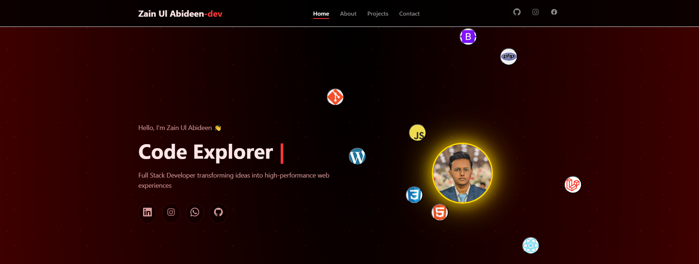

# Zain Ul Abideen: Portfolio

My personal portfolio: who I am, what I work with and the projects I have built.

**Live:** https://zainulabideen5.github.io/zain-ul-abideen-portfolio/



## Sections

- **Home:** introduction with a typing effect
- **About:** background and experience
- **Skills and technologies:** shown as planets orbiting my photo, which opens full size when clicked
- **Projects:** Burger House website, personal portfolio, design portfolio, custom WordPress website, e-commerce website, travel blog and SEO website
- **Contact:** a form that sends straight to my inbox through EmailJS

## Features

- Responsive, from phones to wide screens
- Typing animation and orbit animations
- Smooth scrolling between sections
- Sections animate in as they come into view
- No framework: plain HTML, CSS and JavaScript

## Run it locally

Clone the repository and open `index.html` in a browser. There is no build step.

```bash
git clone https://github.com/zainulabideen5/zain-ul-abideen-portfolio.git
```

## Built with

- HTML5
- CSS3
- JavaScript
- EmailJS

---

[Zain Ul Abideen](https://github.com/zainulabideen5) · Full stack developer · Karachi
